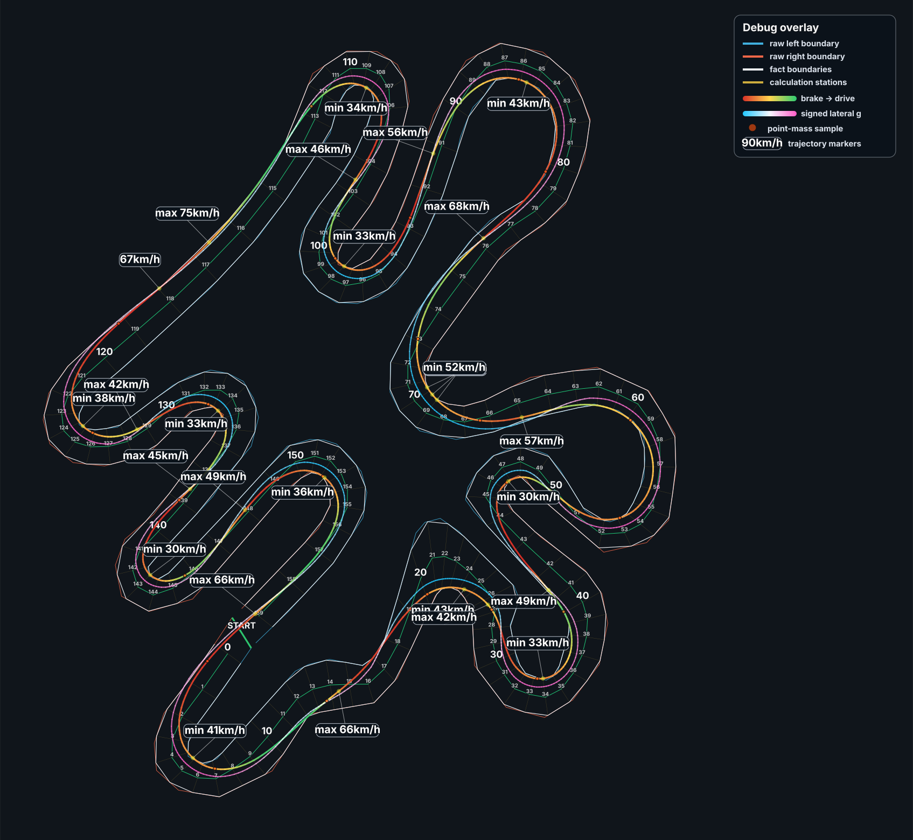
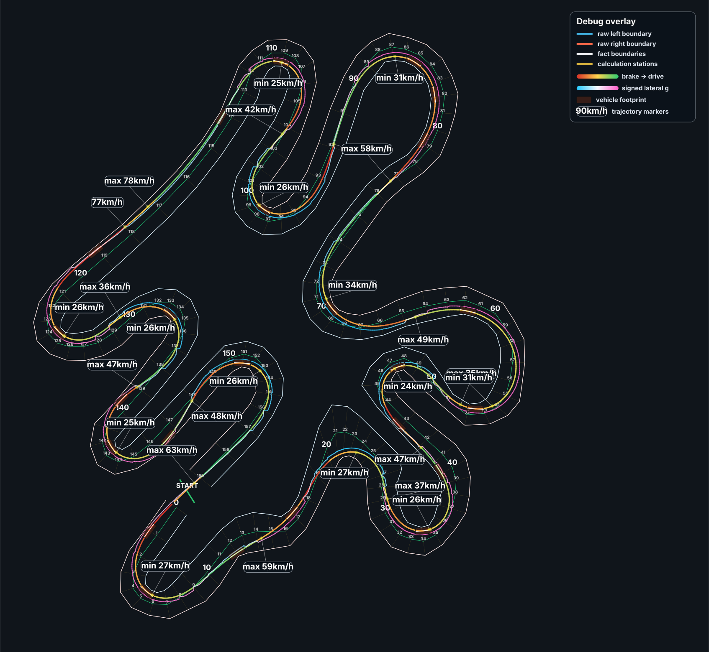
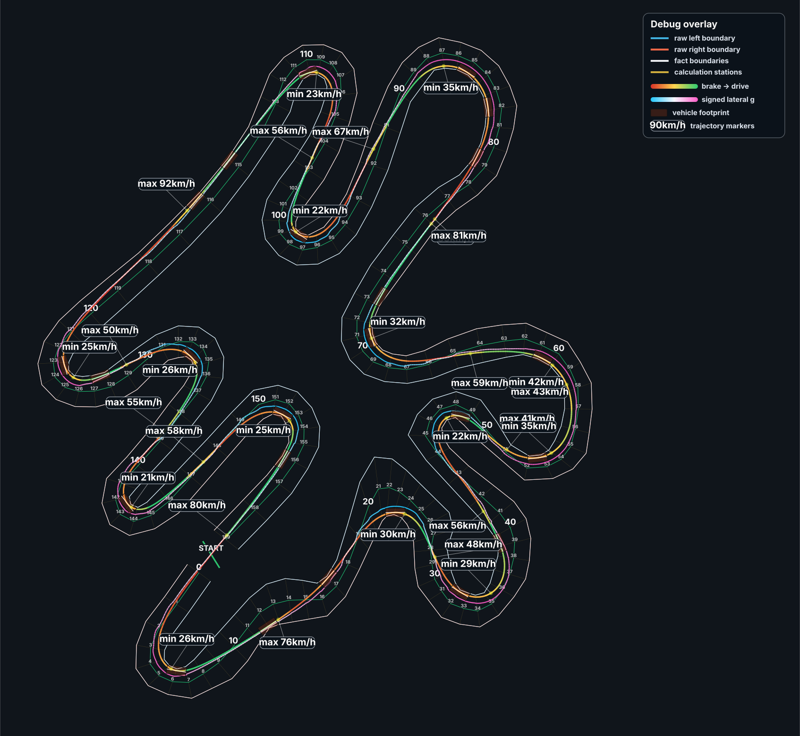
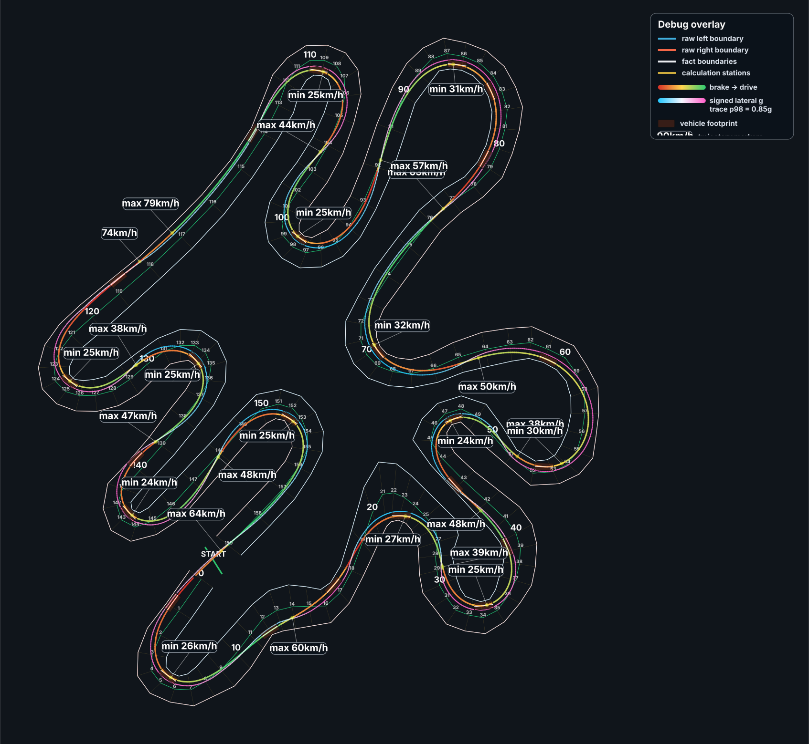
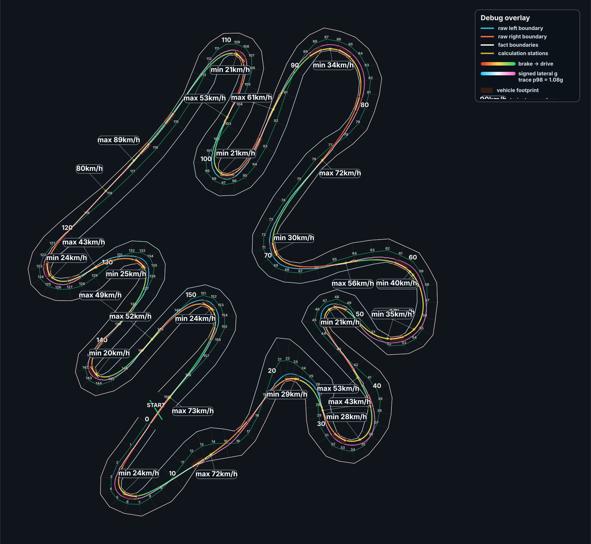

# RaceLine Optimizer

<a href="docs/assets/raceline-point-mass-counterclockwise.svg"></a>

`raceline-optimizer` is a native Rust library and CLI for **racing-line
optimization**, **minimum-time trajectory optimization**, and reproducible track
geometry preparation. It computes locally optimized trajectory candidates
inside explicit left/right track boundaries under configurable vehicle and
geometry constraints.

**License for 0.2.1:** source-available for noncommercial use, modification,
and redistribution under [LICENSE](LICENSE). Commercial use, including paid
products, SaaS, client services, and internal for-profit use, requires prior
written permission from **PE Patsukevich Aleksandr (Red Rat in Hat)**:
[contact@redratinhat.com](mailto:contact@redratinhat.com).
This release is not offered under an OSI open-source license. Earlier releases
retain their original license terms; see [UPSTREAM.md](UPSTREAM.md).

**RaceLineCalc** uses a separate private solver distribution, including the
proprietary V2 models. Its track editor builds tracks from images without
requiring users to assemble the JSON pipeline manually.

- [RaceLineCalc website](https://redratinhat.com/products/racelinecalc/)
- [RaceLineCalc on Google Play](https://play.google.com/store/apps/details?id=com.racelinecalc.mobile)
- [RedRatInHat organization](https://redratinhat.com/)

**Example shown:** a completed counterclockwise point-mass solve using a
README-specific wide-line envelope: 0.5 g drive, 0.5 g braking, and 1.5 g
left/right lateral limits. The technical overlay includes prepared boundaries,
solver stations, speed extrema, signed lateral acceleration, and brake-to-drive
transitions.

<br clear="right">

## What it provides

- Deterministic station geometry for closed circuits and open routes.
- Point-mass, double-track car, and lean-aware motorcycle optimization.
- IPOPT-backed JSON library and CLI with diagnostics, progress, and cancellation.

Results are locally optimized candidates, not claims of global optimality or
real-world lap-time validation.

Solver success and the summary quality flag are not substitutes for the
detailed feasibility audit. Inspect its sample frame: station, collocation,
collocation-polynomial dense, and linear-interpolation diagnostics can differ.
Existing public configurations can retain between-node violations even when
the summary quality flag is clean. `Solved_To_Acceptable_Level` is also distinct
from strict `Solve_Succeeded`.

### Public V1 examples

All examples below use the same technical circuit so that the path and speed
differences come from the model/profile rather than from a different drawing.
Open an image to inspect the full-resolution station, acceleration, and speed
annotations. They illustrate particular configurations rather than a benchmark
or a claim that one vehicle family is inherently faster than another.

| Prepared car preset | Prepared litre-bike preset |
| :---: | :---: |
| [](docs/assets/raceline-car-counterclockwise.svg) | [](docs/assets/raceline-motorcycle-counterclockwise.svg) |
| Existing `mx5_light_sport` profile (1,150 kg, 135 kW, 1.05 nominal tire grip); no profile parameters were modified. | Existing `moto_1000_superbike` profile (210 kg, 150 kW) with lean-aware single-track dynamics; no profile parameters were modified. |

## Proprietary V2 models in RaceLineCalc

RaceLineCalc also includes proprietary **Car V2** and **Moto V2** vehicle
models. Their source code, calibration data, and private qualification fixtures
are not distributed in this repository; the public Rust crate continues to
provide the reusable V1 model families described above.

The V2 models share a deeper contact-and-tire contract while retaining separate
vehicle dynamics:

- **Car V2** adds transient body roll, dynamically coupled wheel loads, camber-
  aware tire response, steering dynamics, and longitudinal/aerodynamic load
  consistency.
- **Moto V2** adds camber-aware tire moments, rake/trail and gyroscopic effects,
  coupled roll-steer-yaw dynamics, physical rider steering authority, and
  transient pitch/contact dynamics.

### Physical motion channels

The counts below describe physical motion channels, not the number of NLP
variables. Frenet path coordinates, collocation copies, force coordinates, and
solver auxiliaries are not additional mechanical degrees of freedom.

| Model | Physical motion channels | What those channels mean | Contact and control depth |
| --- | --- | --- | --- |
| Point V1 (source-available) | Reduced planar translation | Advances and moves laterally inside the track; it has no resolved body attitude. | Acceleration-envelope limits; no wheel, roll, pitch, or steering mechanics. |
| Car V1 (source-available) | 3 rigid-body channels: longitudinal, lateral, yaw | Resolves forward motion, body sideslip, and rotation about the vertical axis. | Four tire contacts and a directly controlled steering angle; vertical loads are equilibrium-constrained rather than transient body-roll states. |
| Car V2 (RaceLineCalc) | 4 rigid-body channels: longitudinal, lateral, yaw, roll | Adds transient rotation of the sprung body about its longitudinal axis. | Dynamically coupled wheel loads, camber-aware tires, a rate-limited steering actuator, and consistent longitudinal/aerodynamic load effects. |
| Moto V1 (source-available) | 4 rigid-body channels: longitudinal, lateral, yaw, lean; plus steering-axis rotation | Adds motorcycle lean and steering motion to planar single-track dynamics. | Front/rear contacts, lean and steering rates, combined grip, and branch-safe tire operation; no resolved pitch/heave chassis motion. |
| Moto V2 (RaceLineCalc) | 6 rigid-body channels: longitudinal, lateral, heave, roll/lean, pitch, yaw; plus steering-axis rotation | Adds vertical chassis travel and fore-aft rotation while retaining coupled lean, yaw, and steering motion. | Transient axle contact loads, camber/tire moments, rake/trail, wheel gyroscopic coupling, and physical rider steering torque. |

The V2 source, equations, coefficients, and calibration remain proprietary. The
table intentionally describes externally meaningful model scope rather than
implementation details.

The RaceLineCalc result view exposes model-owned product traces such as speed,
drive/brake force, grip utilization, body roll or motorcycle lean, and steering
effort. The comparisons below use the same prepared circuit, direction,
160-station geometry, and base vehicle profile on both sides. They are product
examples rather than global-optimum or real-world lap-time claims.

### Matched Car V1 and Car V2 results

| **Public Car V1 result** | **RaceLineCalc Car V2 result** |
| :---: | :---: |
| [](docs/assets/raceline-car-counterclockwise.svg) | [](docs/assets/racelinecalc-car-v2-trajectory.svg) |
| Existing `mx5_light_sport` profile: 1,150 kg and 135 kW; no profile parameters were modified. | The same `mx5_light_sport` base profile: 1,150 kg and 135 kW. Mass and power were not retuned; Car V2 adds its qualified proprietary physics parameters. |

### Matched Moto V1 and Moto V2 results

| **Public Moto V1 result** | **RaceLineCalc Moto V2 result** |
| :---: | :---: |
| [](docs/assets/raceline-motorcycle-counterclockwise.svg) | [](docs/assets/racelinecalc-moto-v2-trajectory.svg) |
| Existing `moto_1000_superbike` profile: 210 kg and 150 kW; no profile parameters were modified. | The same `moto_1000_superbike` base profile: 210 kg and 150 kW. Mass and power were not retuned; Moto V2 adds its qualified proprietary physics parameters. |

## Workspace

| Package                  | Purpose                                                                                     |
| ------------------------ | ------------------------------------------------------------------------------------------- |
| `raceline-optimizer`     | Solver library, public contracts, station generation, vehicle dynamics, and quality checks. |
| `raceline-optimizer-cli` | `raceline-optimize optimize` and `raceline-optimize inspect`.                               |

Only the reusable optimizer and CLI are public here. RaceLineCalc mobile UI,
billing, analytics, image autotracing, FFI packaging, and private product
regression fixtures remain outside this repository.

## Requirements

- Rust 1.85 or newer.
- A compatible IPOPT shared library for actual solves.

The project dynamically loads IPOPT by default; native binaries are not bundled.
Pass the library with `--ipopt-library`, or set `RLC_IPOPT_LIBRARY`. See
[IPOPT setup](docs/IPOPT.md) for platform-specific names and diagnostics.

## Quick start

Clone the repository and verify the public workspace:

```bash
cargo test --workspace
```

Run the included point-mass example:

```bash
cargo run -p raceline-optimizer-cli --bin raceline-optimize -- \
  optimize \
  --track crates/raceline-optimizer-cli/examples/compact-oval-track.json \
  --vehicle crates/raceline-optimizer-cli/examples/point-mass-vehicle.json \
  --output target/compact-oval-result.json \
  --stations 80 \
  --ipopt-library /path/to/libipopt.so
```

Inspect the generated trajectory without solving it again:

```bash
cargo run -q -p raceline-optimizer-cli --bin raceline-optimize -- \
  inspect target/compact-oval-result.json
```

On Windows PowerShell, replace the trailing `\` line continuations with
backticks and pass a compatible `libipopt-3.dll` path. More car and motorcycle
examples are in the
[CLI documentation](crates/raceline-optimizer-cli/README.md).

## Input and output contracts

The ordinary `optimize` workflow keeps versioned solver request envelopes out of
the user interface:

1. `--track` accepts a `TrackAreaContractV1` JSON document containing the left
   and right boundaries, units, route mode, direction, and optional open-route
   start/finish geometry.
2. `--vehicle` accepts `raceline_optimizer_vehicle.v1` and selects
   `point_mass`, `car`, or `bike` plus its vehicle profile.
3. The CLI generates deterministic station geometry and dispatches the matching
   public solver API.
4. Successful solves emit `rust_solver_response.v1`; failures emit the typed
   `rust_solver_error.v1` schema.

Advanced integrations can use `prepare` to build station geometry without a
vehicle solve, and `solve` to replay a complete versioned request. These commands
do not introduce a new request schema; see the
[CLI documentation](crates/raceline-optimizer-cli/README.md#prepare-and-replay).

The examples are small synthetic tracks and profiles intended to be copied and
modified. See [architecture](docs/ARCHITECTURE.md) for the full data flow.

## Library API

The stable integration boundary starts in `raceline_optimizer::solver_api`:

- `solve_point_mass_json`
- `solve_car_mintime_json`
- `solve_bike_mintime_json`
- progress/cancellation variants for each solve family
- `build_station_geometry_json`

These functions preserve typed error codes and the same JSON output contracts as
the CLI. Lower-level modules remain public in `0.1.x` for research and advanced
integration, but may be narrowed before `1.0`.

## Known limits

- IPOPT availability and its native linear-solver configuration are external to
  this crate.
- Input boundaries must describe a coherent corridor; folded or crossing station
  sections are rejected by topology and section-frame validation.
- Numerical convergence is model-, track-, initialization-, and scale-dependent.
- The repository does not include a GUI or image-to-track extraction.
- The public API is pre-1.0 and may evolve with explicit release notes.

## Development

Before opening a pull request, run:

```bash
cargo fmt --all -- --check
cargo clippy --workspace --all-targets -- -D warnings
cargo test --workspace
```

See [CONTRIBUTING.md](CONTRIBUTING.md), [SECURITY.md](SECURITY.md), and the
[GitHub Actions workflow](.github/workflows/ci.yml). Maintainers should also use
the [release checklist](docs/RELEASING.md), which records the required library →
CLI publish order.

## Upstream history and license

This repository preserves its historical fork relationship with
`TUMFTM/global_racetrajectory_optimization`, while the current working tree is
an independently developed Rust implementation imported from RaceLineCalc.
Exact transition commits, checksums, and license boundaries are documented in
[UPSTREAM.md](UPSTREAM.md) and [EXPORT-MANIFEST.json](EXPORT-MANIFEST.json).

The 0.2.1 Rust distribution is source-available under [LICENSE](LICENSE), with
commercial use requiring a separate written license. Preserved MIT/Apache
license texts document earlier Rust releases; they are not an alternative
license grant for this release as a whole. Historical upstream commits and
removed upstream files remain under LGPL-3.0. This project does not claim
endorsement by TUMFTM.
