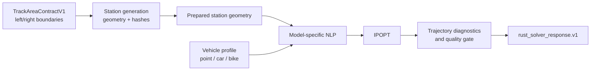

# Architecture

RaceLine Optimizer separates public geometry contracts, deterministic station
generation, vehicle models, nonlinear optimization, and result validation.

## Contracts and geometry

`contracts` defines the public track, vehicle, trajectory, and visualization
schemas. `station_generation` converts track boundaries into a deterministic
station bundle. `station` and `section_frame` validate orientation, corridor
topology, curvature, and offset geometry.

The prepared geometry is hashed and carried into the solve request. This keeps
the optimizer from silently regenerating a different route during a solve.

## Solver families

- `point_mass` solves a velocity-vector optimal-control problem using an
  acceleration envelope.
- `car_mintime` builds a double-track vehicle NLP with tire, load-transfer, and
  minimum-time terms.
- `bike_mintime` builds a single-track motorcycle NLP with lean and steering
  dynamics.
- Kart configurations use the car solver with kart-specific dimensions, mass,
  tire, and drivetrain parameters.

`mintime_common`, `dense_frenet`, and `vehicle_dynamics` contain numerical
building blocks shared by the model families.

## IPOPT boundary

`ipopt` owns the native solver boundary. Default builds load IPOPT dynamically;
the path is selected explicitly, through `RLC_IPOPT_LIBRARY`, or through the
platform default library name. Native-backend failures are returned as
`solve.nativeBackendUnavailable`, not as partial trajectories.

## Public facade

`solver_api` is the intended library integration boundary. It exposes typed JSON
solve functions, station generation, progress callbacks, and cancellation. The
CLI composes the public track and vehicle documents into the prepared request
expected by this facade.

## Validation boundary

The public repository contains synthetic contract and numerical tests. Large
product fixtures, mobile packaging, exact private parity corpora, and release
validation remain in the RaceLineCalc product repository. This keeps the public
package reproducible without weakening the product's private regression suite.
